## 微博“厕所用户”一键拉黑工具

### 概述

在微博的浩瀚宇宙中，存在着一类被称为“厕所账号”的阴影，它们以匿名投稿的方式肆意扩散负能量，从隔空喊话到挑起争端，乃至煽动网络暴力💢 这些厕所账号无所不用其极，破坏着社区的和谐与信任，使得整个平台的氛围如同黑暗森林一般充满了猜忌和阴霾。

众多微博用户深受其害，却往往感到无力回击😓。这些厕所账号的追随者，无一例外，都沉迷于匿名区的潮湿与阴暗，为负能量的传播助力加油。为了净化你的微博环境，我们开发了这款一键拉黑工具，旨在帮助你脱离这些账号的负面影响，重塑一个清新的微博空间。有了这款一键拉黑工具，清理这些网络垃圾变得触手可及🧹。

### 项目背景

**微博“厕所账号”一键拉黑工具** 是由一位饱受“厕所账号”困扰的微博用户发起的项目🏄‍♂️。此工具集成了**Dogs Killer**项目中的批量拉黑功能，并对获取厕所账号粉丝名单的策略进行了重新编写，以确保时序和逻辑的准确性。经过多轮测试，此工具已被证实为有效且可靠。

### 功能说明

- **全自动拉黑**: 自动识别并拉黑厕所账号的所有粉丝，无需手动逐一操作。
- **零误伤机制**: 精准识别，确保不会牵连到无辜的普通用户。
- **简单易用**: 仅需简单设置，即可快速清理你的微博环境。

### 环境准备

- 一台装有任何chrome内核浏览器的电脑

### 使用方法

1. 登录PC版微博。如果已经和厕所双拉黑，可能获取不到粉丝列表，这时候需要采用小号获取uid列表，再由大号进行批量拉黑。会代码这很简单，不会也没关系，你奶奶都能看懂的拉黑教程会在稍后推出。

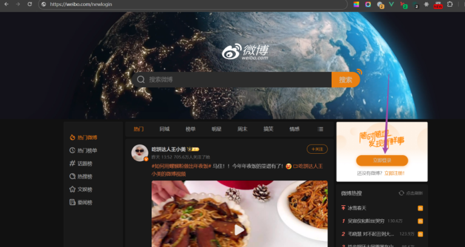

2. 右上角账号设置 - 屏蔽设置

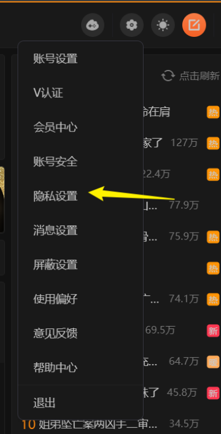

3. 点击键盘上的f12，调出开发者工具，右上角“网络”选项卡

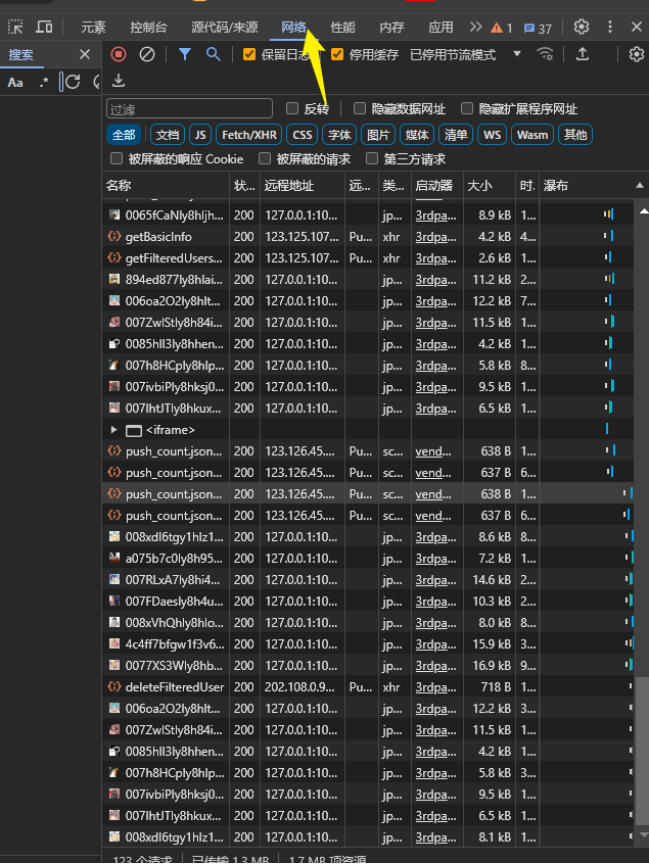

> tips
有些电脑f12是系统自带功能键，需要按住键盘左下角的“fn”键，再按“F12”
如果是macbook，则需要同时按下“Command”键和“F12”


4. 点击“解除屏蔽”先放厕所出来透透气。别担心，待会关回去。解除屏蔽同时观察右侧网络面板。

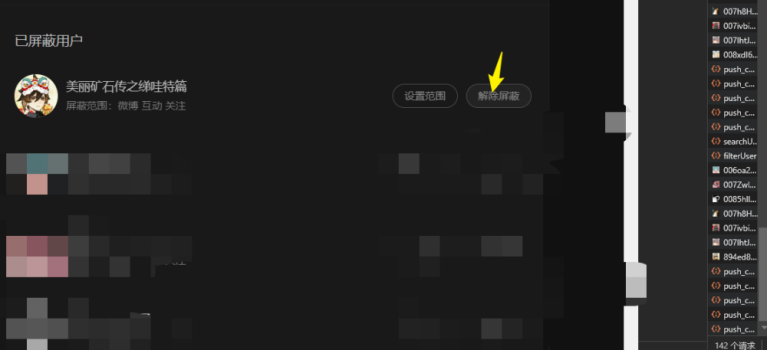


在你鼠标按下的同时，右边会多出来几行

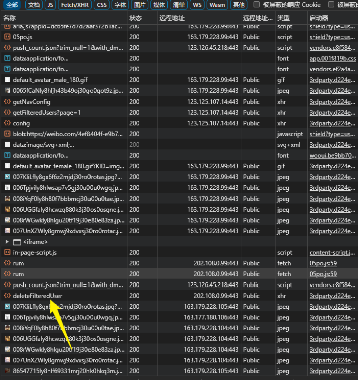

5. 在上一步网络面板增加的请求中，找到deleteFilteredUser这个请求，鼠标点击，找到“响应”选项卡，寻找其中uid=xxx的字样，把uid=xxx后面那串数字复制下来

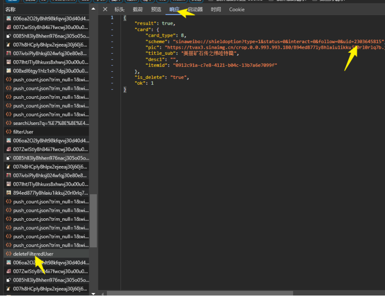


6. 从“网络”选项卡切换到“控制台”选项卡

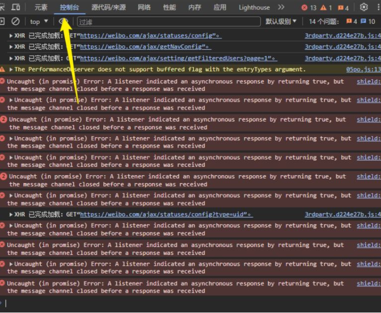

7. 进入项目文件[Ce-Mei-Killer.js](https://github.com/tohsakrat/Ce-Mei-Killer/blob/main/Ce-Mei-Killer.js)，复制全部代码，粘贴到控制台中，直接**回车**。

8. 然后单独输入下面这行，并且把目标uid替换成你要拉黑的厕所的uid。  **回车执行**

```javascript
mainBlockAll(2303645815)// 把2303645815替换为目标用户ID，一键拉黑
```
 
> tips
遇到了奇奇怪怪的问题，有用户表示找不到光标没法粘贴，注意看光标在">"符号右边那条狭窄细长的区域，用鼠标多点几下，没有光标出来就是没点对地方
> 
>  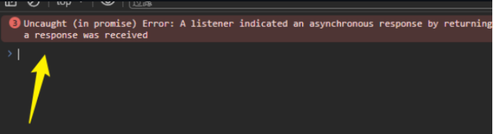
> 
> 有用户遇到了不能粘贴
> 
> 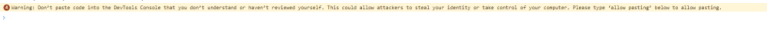
> 
> 参考[这篇文章](https://blog.csdn.net/KimBing/article/details/134938756)，在输入框手打allow pasting，然后回车，接下来就可以粘贴了


这时候代码就开始跑起来了，效果如下：
这是在获取粉丝列表

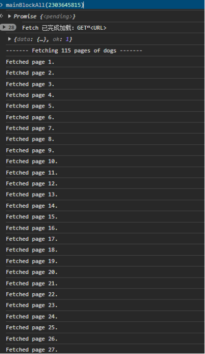


获取完成后，会把粉丝列表打印在控制台中。以防万一，可以右键保存，粘贴在本地记事本中。这样下次进入页面就不用重新获取了。

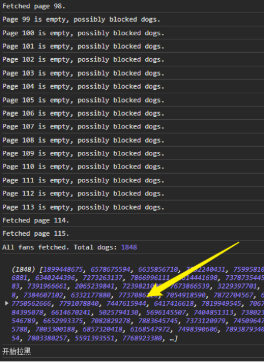

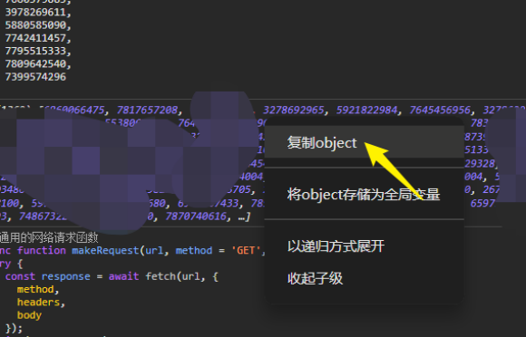


这是开始拉黑了

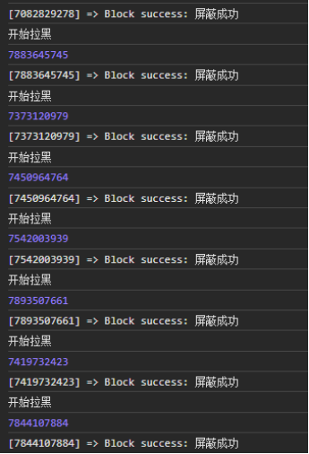


12. 喝杯茶，静待拉黑完成，如果遇到请求太频繁被大眼制裁（下图）不要慌张

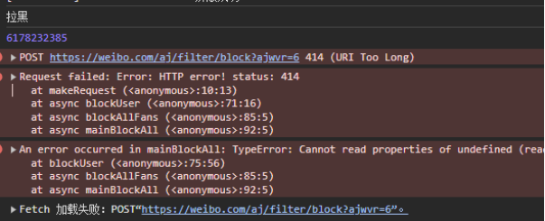

13.首先记录出问题前最后一个账号的uid

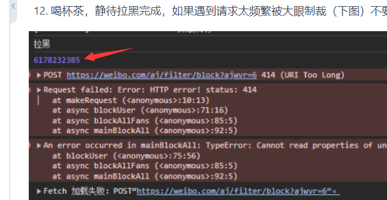

然后在控制台输入下面这行回车
```javascript
window.allDogs
```
或者滚动控制台，回到一开始的提示

这两种方法都可以看到形如下图的东西，这就是你要拉黑的账号列表数组。
右键复制完整的dogs数组，粘贴到本地的记事本之类的地方保存。


14. 刷新页面后，在控制台输入


```javascript
window.allDogs=[...]
//[...]为你刷新前复制的厕所粉丝数组，替换一下
```
再次在[Ce-Mei-Killer.js](https://github.com/tohsakrat/Ce-Mei-Killer/blob/main/Ce-Mei-Killer.js)，复制全部代码，粘贴到控制台中**回车**
然后单独输入下面这行，把12345换成刚刚最后一次报错前正在处理的uid，**回车**。

```javascript
 mainResume(12345)//从上一次失败处开始拉黑，把12345换成刚刚最后一次报错前正在处理的uid。用于请求太频繁被大眼制裁的情况
```

### Ce-Mei-Killer.js代码正文
由于国内访问github可能存在一定问题，为方便用户使用，这里将代码正文也附在说明中。
```javascript
// 通用的网络请求函数
async function makeRequest(url, method = 'GET', body = null, headers = {}) {
  try {
    const response = await fetch(url, {
      method,
      headers,
      body
    });
    if (!response.ok) {
      throw new Error(`HTTP error! status: ${response.status}`);
    }
    return await response.json();
  } catch (error) {
    console.error('Request failed:', error);
  }
}

// 获取总页数
async function getTotalPages(uid, pageSize) {
  const url = `https://weibo.com/ajax/user/popcard/get?id=${uid}`;
  const data = await makeRequest(url);
  if (data) {
    console.log(data);
    const followersCount = parseInt(data.data.followers_count_str, 10);
    return Math.ceil(followersCount / pageSize);
  }
  return 0;
}

// 获取某一页的粉丝
async function fetchPage(uid, page) {
  const url = `https://weibo.com/ajax/friendships/friends?relate=fans&page=${page}&uid=${uid}&type=fans&newFollowerCount=0`;
  const data = await makeRequest(url);
  if (data && data.users && data.users.length > 0) {
    console.log(`Fetched page ${page}.`);
    return data.users;
  } else {
    console.log(`Page ${page} is empty, possibly blocked dogs.`);
    return [];
  }
}

// 获取所有粉丝的封装函数
async function fetchAllFans(uid) {
  const pageSize = 20;
  const totalPages = await getTotalPages(uid, pageSize);
  console.log(`------- Fetching ${totalPages} pages of dogs -------`);
  if (totalPages === 0) {
    console.log('No pages to fetch or error occurred.');
    return [];
  }

  let allFans = [];
  for (let page = 1; page <= totalPages; page++) {
    const fans = await fetchPage(uid, page);
    allFans = allFans.concat(fans);
  }
  allFans = allFans.map(e=>e.id)
  
  allFans.push(uid);
  console.log('All dogs fetched. Total dogs:', allFans.length);
  console.log(allFans)
  return allFans;
}

// 拉黑某个用户
async function blockDog(userId) {
	
	console.log("开始拉黑")
	console.log(userId)
  var url = 'https://weibo.com/aj/filter/block?ajwvr=6';
  var body = `uid=${userId}&filter_type=1&status=1&interact=1&follow=1`;
  var headers = {
    'Content-type': 'application/x-www-form-urlencoded'
  };
  const data = await makeRequest(url, 'POST', body, headers);
  if (data && data.code == 100000) {
    console.log(`[${userId}] => Block success: ${data.msg}`);
  } else {
    console.error(`[${userId}] => Block failed: ${data.msg}`);
  }
}

// 拉黑所有粉丝
async function blockAllDogs(uid) {
  window.allDogs = await fetchAllFans(uid);
   mainBlockList(window.allDogs); 
}

// 主函数 - 一键拉黑版本
async function mainBlockAll(uid) {
  try {
    await blockAllDogs(uid);
  } catch (error) {
    console.error('An error occurred in mainBlockAll:', error);
  }
}

// 主函数 - 只获取厕所账号粉丝版本
async function mainFetchFans(uid) {
  try {
    await fetchAllFans(uid);
  } catch (error) {
    console.error('An error occurred in mainFetchFans:', error);
  }
}

// 暴力法延迟
function delay(ms) {
  return new Promise(resolve => setTimeout(resolve, ms));
}

// 主函数 - 只拉黑一个uid数组版本
async function mainBlockList(uids) {
  if (typeof window.allDogs == 'undefined') window.allDogs = uids;
  try {
    for (let index = 0; index < uids.length; index++) {
      const userId = uids[index];
      console.log(`Blocking dog ${userId} at index ${index} total ${uids.length}`); // 输出当前userId和下标
      await blockDog(userId); // 执行拉黑操作
      await delay(400); // 等待0.4秒
    }
	
  } catch (error) {
    console.error('An error occurred in mainBlockList:', error);
  }
}

// 主函数 - 从上一次失败处重新kill
async function mainResume(uid) {
  try {
    const dogs = window.allDogs || [];
    const index = dogs.indexOf(uid);
    if (index === -1) {
      console.log('UID not found in allDogs.');
      return;
    }
    const dogsToBlock = dogs.slice(index); // 从指定的UID开始到数组末尾的所有dogs
	console.log("继续拉黑")
	console.log(dogsToBlock)
    mainBlockList(dogsToBlock); // 开始拉黑操作
  } catch (error) {
    console.error('An error occurred:', error);
  }
}


// 根据需要调用不同的主函数
//mainBlockAll(2303645815); // 替换为目标用户ID，一键拉黑
// mainFetchFans(2303645815);//只获取厕所粉丝
// mainFetchFans(2303645815); // 替换为目标用户ID，只获取厕所账号粉丝
// mainBlockList([12345, 67890]); // 替换为需要拉黑的用户ID数组，只拉黑指定用户
 //mainResume(12345)//从上一次失败处开始拉黑，用于请求太频繁被大眼制裁的情况 
```
### 贡献和支持
如果这个工具帮你扫除了网络环境中的负能量，像一股清流🌊🌊🌊不妨给我们一个星标（Star✨），你的支持是我们最大的动力。同时，如果在使用过程中遭遇任何问题，欢迎提交问题（Issue🤔），我们会积极响应并完善工具。
### 免责声明
本开源项目（以下简称“项目”）提供的一键拉黑账号全部粉丝的工具（以下简称“工具”）旨在提供一种自动化的方式来协助用户对抗网络上的“厕所账号”和恶意用户。在此明确指出，“厕所账号”通常是指那些散布令人不悦信息、从事网络骚扰、故意制造纷争或其它有害社交网络环境行为的账户。
使用者在使用本项目提供的工具时，应确保遵循以下原则：

1. **合法使用**：使用本工具应严格遵守所有适用的法律法规，不得违反任何网络平台的服务条款。
2. **目的明确**：本工具仅供对抗和防范“厕所账号”和恶意用户之用，使用者不得将其用于非法或不当目的。
3. **自行承担责任**：使用者应自行承担使用本工具所可能带来的一切后果。项目开发者不承担任何直接或间接因使用本工具而产生的法律责任或其它任何形式的责任。
4. **不得滥用**：本工具不得用于滥用或非针对性的大规模拉黑行动，使用者应当明智、审慎地使用本工具。
5. **隐私尊重**：使用本工具时，不得侵犯任何第三方的合法权益。

---

Gegerated by GPT4-Turbo
